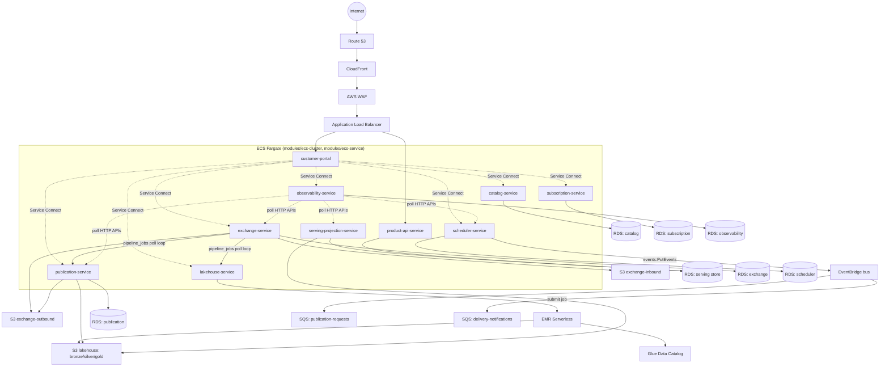
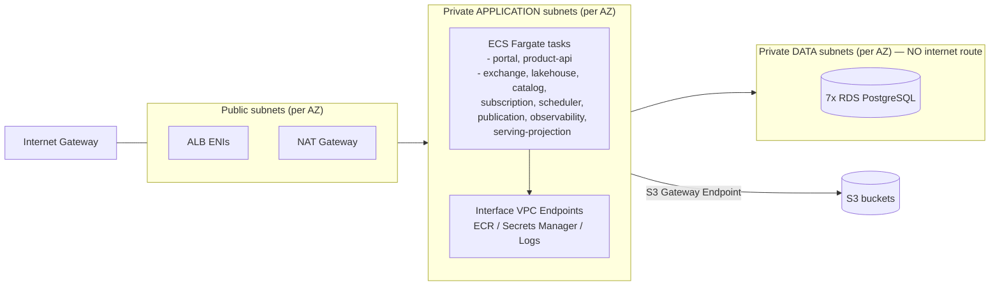
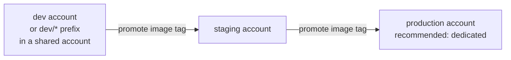

# AWS Architecture

Status: **NOT DEPLOYED.** This describes what `infrastructure/terraform/` is capable of producing,
not anything that currently exists in an AWS account.

## Logical architecture



MongoDB (portal user/org/tenant directory) is intentionally absent from this diagram — see
`docs/aws/architecture-decisions.md` #3. It is not deployed by this Terraform package.

## Physical / account-boundary view



Every RDS instance sits in a subnet tier with no route to the internet at all (see
`modules/networking`) — this makes "public RDS" a structural impossibility, not a checkbox. See
`docs/aws/networking.md`.

## Terraform / module architecture

```mermaid
flowchart TB
    subgraph bootstrap["infrastructure/terraform/bootstrap (local state, run once per account)"]
        b1[S3 state bucket + KMS key]
    end

    subgraph envs["infrastructure/terraform/environments/{dev,staging,production}"]
        e1[main.tf — near-identical across all three]
    end

    subgraph modules["infrastructure/terraform/modules (20 reusable modules)"]
        m1[networking]
        m2[security]
        m3[kms]
        m4[s3]
        m5[secrets]
        m6[rds]
        m7[iam]
        m8[ecr]
        m9["ecs-cluster / ecs-service"]
        m10[alb]
        m11["cloudfront / waf / route53"]
        m12[glue]
        m13["emr-serverless"]
        m14["eventbridge / sqs"]
        m15[observability]
        m16[backup]
    end

    e1 -->|backend "s3" {} configured via backend.<env>.hcl| b1
    e1 --> modules
```

## Account / environment strategy



See `docs/aws/account-strategy.md` for the reasoning and trade-offs, and
`docs/aws/gcp-portability.md` for how each AWS choice above maps to GCP if ever needed.
