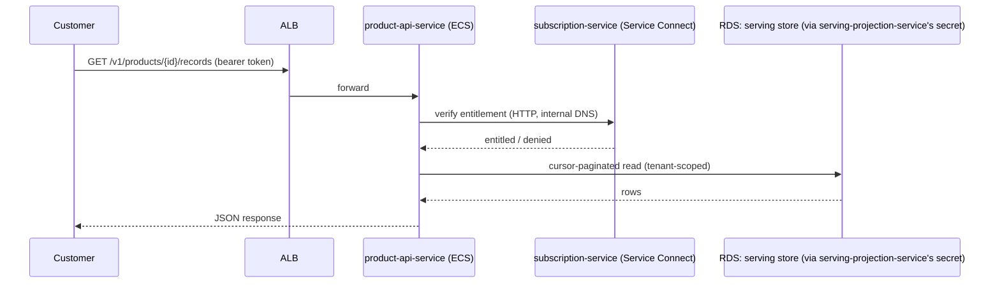

# Compute (ECS Fargate)

Ten services on one ECS Fargate cluster per environment (`modules/ecs-cluster` +
`modules/ecs-service` x10, `for_each` over `local.ecs_services` in each environment's `main.tf`).
No EKS, no Lambda — Fargate only, per Phase 12 §3/§23.

## Public vs. internal

Only `customer-portal` and `product-api-service` get an ALB listener rule (`public = true` in
`local.ecs_services`); every other service is reachable only from other ECS tasks. See
`docs/aws/networking.md` for the security-group chain enforcing this.

## Service discovery: ECS Service Connect

See `docs/aws/architecture-decisions.md` #9 for why this exists. `modules/ecs-cluster` creates a
private Cloud Map DNS namespace (`{project}-{env}.internal`); every `modules/ecs-service` instance
registers into it, reachable at `<service-name>.{project}-{env}.internal:<port>` from any task in
the same cluster/namespace — e.g. `catalog-service.dpp-dev.internal:8092`. This replaces
hard-coded `host.docker.internal` URLs used locally (see
`docs/aws/current-state-inventory.md` §12) with real internal DNS.

## API delivery flow

## Task definition shape (every service, `modules/ecs-service`)

- Fargate only, `awsvpc` network mode, private application subnets, no public IP.
- One container, image from `var.container_images[<service>]` (a placeholder until real images are
  pushed — see `docs/aws/new-account-deployment.md` Part H/I).
- `awslogs` driver to a per-service KMS-encrypted CloudWatch log group.
- No container-level `HEALTHCHECK` — this platform's ten services run on different base images
  (Alpine/Node vs. Python slim) with no single reliable HTTP-check binary in common. Public
  services are health-checked by the ALB target group; internal services by
  `data-platform-observability-service`'s existing poll loop (unchanged from local behavior).
- `enable_execute_command = true` — `aws ecs execute-command` works for break-glass debugging
  without SSH/bastion infrastructure.

## Autoscaling

Target-tracking on both CPU (default target 60%) and memory (70%) utilization, per service,
independently. `min_capacity`/`max_capacity` are environment variables (`ecs_max_capacity`); actual
desired count starts at `ecs_public_desired_count`/`ecs_internal_desired_count` and scales within
that range.

## Uniform sizing — a deliberate Phase 12 simplification

Every service in a given environment gets the same `cpu`/`memory` (`var.ecs_cpu`/`var.ecs_memory`)
rather than per-service tuning. This is a starting point, not a claim that every service has
identical resource needs — grow specific services by editing that service's `module.ecs_service`
call (or splitting `local.ecs_services` to carry per-service overrides) once real CPU/memory
utilization data justifies it (`modules/observability` already reports exactly this metric).
