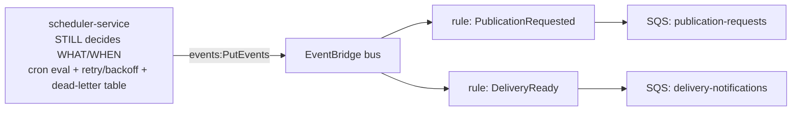

# Eventing (EventBridge + SQS)

## This is genuinely new infrastructure — read before assuming it replaces something

`docs/aws/current-state-inventory.md` confirms: **no message broker exists anywhere in this
platform locally.** Every "queue" today is an in-process, database-backed polling loop:

- `data-exchange-service`: a `pipeline_jobs` Postgres table + a poll-loop worker.
- `scheduling-service`: `cron-parser` evaluation + retry/backoff + a `scheduler_dead_letter` table.
- `data-platform-observability-service`: polls six sibling HTTP APIs on independent intervals.

`modules/eventbridge` and `modules/sqs` do not replace any of this. They add a transport layer for
the same domain events these services already represent as Postgres row-state transitions.

## Scheduler responsibility — unchanged

EventBridge/SQS **transport** work; they are not the authoritative workflow database, and no
EventBridge Scheduler rule encodes business delivery policy — that stays entirely in
`scheduling-service`'s own cron/backoff/dead-letter logic (Phase 12 §36).

## Domain events carried

`ExchangeUploaded`, `BronzeReady`, `SilverReady`, `GoldReady`, `PublicationRequested`,
`PublicationReady`, `DeliveryReady` — one EventBridge rule per event name on a dedicated custom bus
(`modules/eventbridge`), with a 90-day replay archive for operational recovery (not a system of
record).

## Queues (`modules/sqs`)

Two queues wired to the bus by default: `publication-requests`, `delivery-notifications`. Every
queue gets its own dead-letter queue (`max_receive_count = 5` default), a redrive-allow policy
restricting the DLQ to receive only from its own source queue, and a CloudWatch alarm firing the
moment the DLQ receives any message at all (`threshold = 0`) — a non-empty DLQ always means a
consumer is failing repeatedly, never routine.

**Consumers must assume at-least-once delivery** — standard SQS semantics. This platform's existing
idempotency-key handling (every TS service's `idempotency_records` table) already exists for this
exact reason and needs no change to work correctly against SQS-delivered messages.

## Adding a new queue/rule

Add an entry to `modules/sqs`'s `queues` map in the relevant `environments/<env>/main.tf`, then wire
an `aws_cloudwatch_event_target` + `aws_sqs_queue_policy` (see the existing two as a template) —
this environment-level wiring (rather than baking targets into `modules/eventbridge` itself) keeps
the eventbridge module decoupled from which queues happen to exist.
