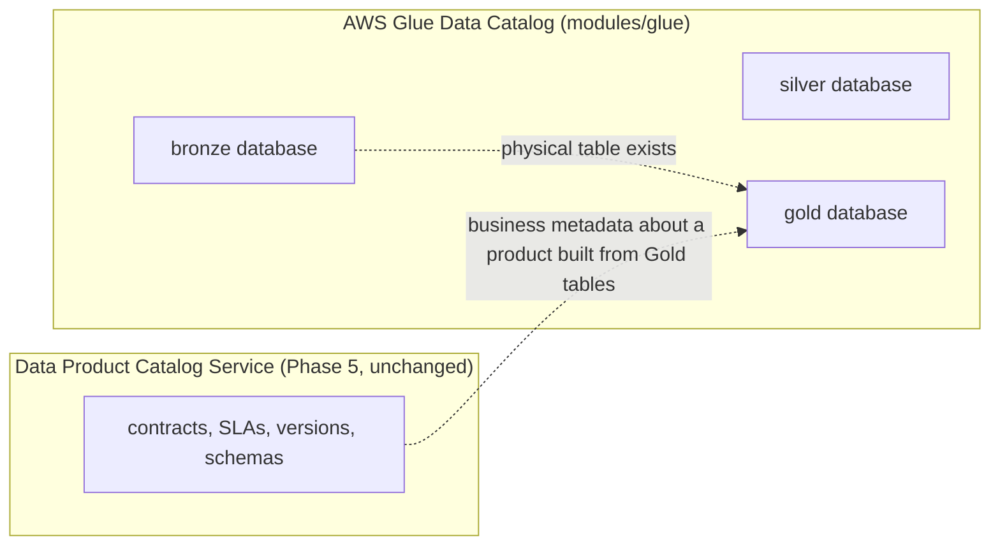

# Lakehouse (Iceberg on S3 + Glue + EMR Serverless)

## Glue Data Catalog vs. Data Product Catalog Service — do not conflate



Glue is the **physical** lakehouse metadata store: table schemas, partitions, snapshot pointers —
what PyIceberg's local `SqlCatalog` was. The Data Product Catalog Service is the **business**
metadata store — contracts, SLAs, versions. An entry existing in one implies nothing about the
other; a Gold table can exist in Glue with no corresponding Data Product registered yet, and vice
versa a registered Data Product's underlying table could be missing. Reconciling the two is
existing catalog-service/lakehouse-service logic, unchanged by this phase.

## Catalog migration: SqlCatalog (Postgres) → Glue

`data-lakehouse`'s own code already documents this swap as configuration-only:

```python
# swapping to a production catalog (e.g. AWS Glue) later is a configuration change here only
```

`modules/glue` creates three Glue databases (`{project}_{env}_bronze/silver/gold`) and sets
account/region-level Glue Data Catalog encryption (SSE-KMS, primary key). No Postgres-backed
`SqlCatalog` exists in AWS — see `docs/aws/architecture-decisions.md` #2 for why `data-lakehouse`
gets no RDS instance.

## EMR Serverless

`modules/emr-serverless` (gated by `enable_emr`, off by default in dev) provisions:

- One EMR Serverless `SPARK`-type application, auto-start/auto-stop enabled (15-minute idle
  timeout — no idle compute cost), network config in the private application subnets.
- A dedicated `lakehouse-job-role` (see `docs/aws/iam-permission-matrix.md`): R/W the lakehouse
  bucket, R/W the three Glue databases, its own CloudWatch log group.
- A CloudWatch log group for job output (`/emr-serverless/{name_prefix}-lakehouse`).

**No PySpark exists in this codebase today** (confirmed in `docs/aws/current-state-inventory.md`)
— the Bronze→Silver→Gold logic is pure PyIceberg/pyarrow/pandas. EMR Serverless here is
provisioned capacity, not a migration target for existing code: submitting a real job means either
(a) porting the existing transformation logic to PySpark (a real engineering task, out of Phase
12's scope — "do not rewrite Spark transformations" is read here as "do not invent a Spark rewrite
in this phase"), or (b) running the existing Python job some other way (e.g. as an ECS task,
`lakehouse-service`'s own container) and treating EMR Serverless as a scale-out option for later.

### Submitting a job (once real transformation code targets Spark)

EMR Serverless has no application-level logging config — logging is set per job run:

```bash
aws emr-serverless start-job-run \
  --application-id <from `terraform output emr_serverless_application_id`> \
  --execution-role-arn <lakehouse-job-role ARN> \
  --job-driver '{"sparkSubmit": {"entryPoint": "s3://.../bronze_to_silver.py"}}' \
  --configuration-overrides '{
    "monitoringConfiguration": {
      "cloudWatchLoggingConfiguration": {
        "enabled": true,
        "logGroupName": "/emr-serverless/dpp-dev-lakehouse"
      }
    }
  }'
```

## Bronze / Silver / Gold — unchanged semantics

Partitioning (Bronze: tenant + ingestion day; Silver/Gold: tenant + date month) and the layer
boundaries themselves are unchanged — only the physical storage (S3 vs. MinIO) and catalog (Glue
vs. local Postgres `SqlCatalog`) implementations differ. `docs/pipeline-job-queue-design.md`
(existing) still governs how Bronze→Silver→Gold is orchestrated at the application level.

## Iceberg maintenance (snapshot expiration, orphan cleanup, compaction)

Not scheduled by this Terraform package, and not run automatically. Phase 12 §42 is explicit: do
not schedule destructive production maintenance automatically until deployment configuration
explicitly enables it. When you're ready, these are ordinary EMR Serverless (or ECS task) jobs
using PyIceberg's own maintenance APIs (`expire_snapshots()`, `remove_orphan_files()`,
`rewrite_data_files()` for compaction) — same `lakehouse-job-role` permissions already cover them.
Trigger via EventBridge Scheduler (not built here — a small addition to `modules/eventbridge` if/
when needed) once you've decided a cadence and reviewed retention requirements against
`docs/security/retention-deletion.md` and any legal-hold obligations.
