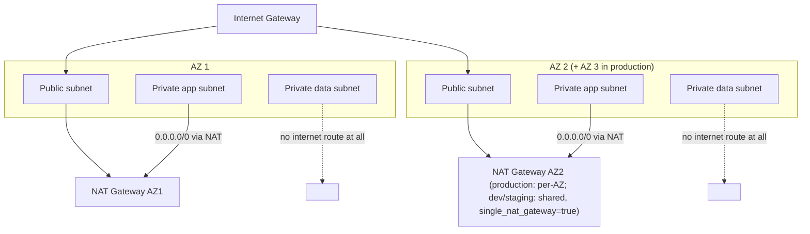
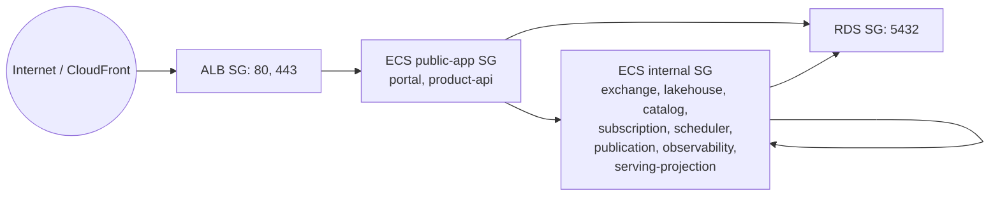
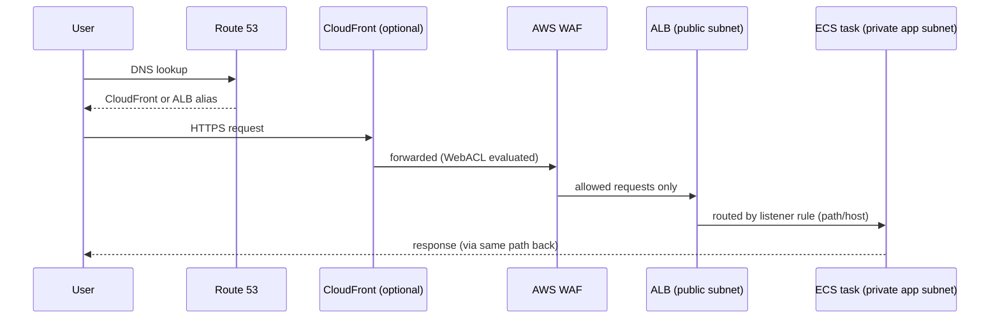

# Networking

`modules/networking` builds the standard three-tier VPC:

- **Public subnets**: ALB only.
- **Private application subnets**: every ECS Fargate task, and the interface VPC endpoints.
- **Private data subnets**: every RDS instance. These subnets' route table has no `0.0.0.0/0` route
  to anything — not the NAT gateway, not the IGW — so a database here cannot reach or be reached by
  the internet regardless of any security-group or `publicly_accessible` misconfiguration.

## VPC Endpoints

`enable_vpc_endpoints = true` (the default) creates:

- Gateway endpoint: **S3** (attached to every route table — public, private-app, private-data), so
  S3 traffic (bucket reads/writes) never leaves the AWS network or incurs NAT data-processing cost.
- Interface endpoints: **ECR (`ecr.api`, `ecr.dkr`)**, **Secrets Manager**, **CloudWatch Logs** — all
  in the private application subnets, with a dedicated security group allowing HTTPS only from
  inside the VPC CIDR. This means ECS tasks can pull images, fetch secrets, and ship logs even in a
  fully NAT-less environment (`enable_nat_gateway = false`) — though EMR Serverless and any
  third-party API calls still need a NAT path or their own endpoint.

## Security groups (`modules/security`)

RDS's security group has **no egress rule at all** (a database never initiates outbound
connections) and only two ingress rules: from the ECS public SG and the ECS internal SG, both on
5432. Nothing else — not even other security groups in the same VPC — can reach port 5432.

## VPC/subnet CIDR sizing

Each environment's `terraform.tfvars.example` uses a distinct `/16` (dev `10.10.0.0/16`, staging
`10.20.0.0/16`, production `10.30.0.0/16`) so a future VPC peering connection between environments
(rare, but sometimes needed for a migration) never collides. Adjust before a real deploy if your
organization has its own IP address plan.

## Public request path

If `enable_cloudfront = false`, the same chain applies minus the CloudFront hop, with WAF (if
enabled) associated directly with the ALB instead (`REGIONAL` scope).
