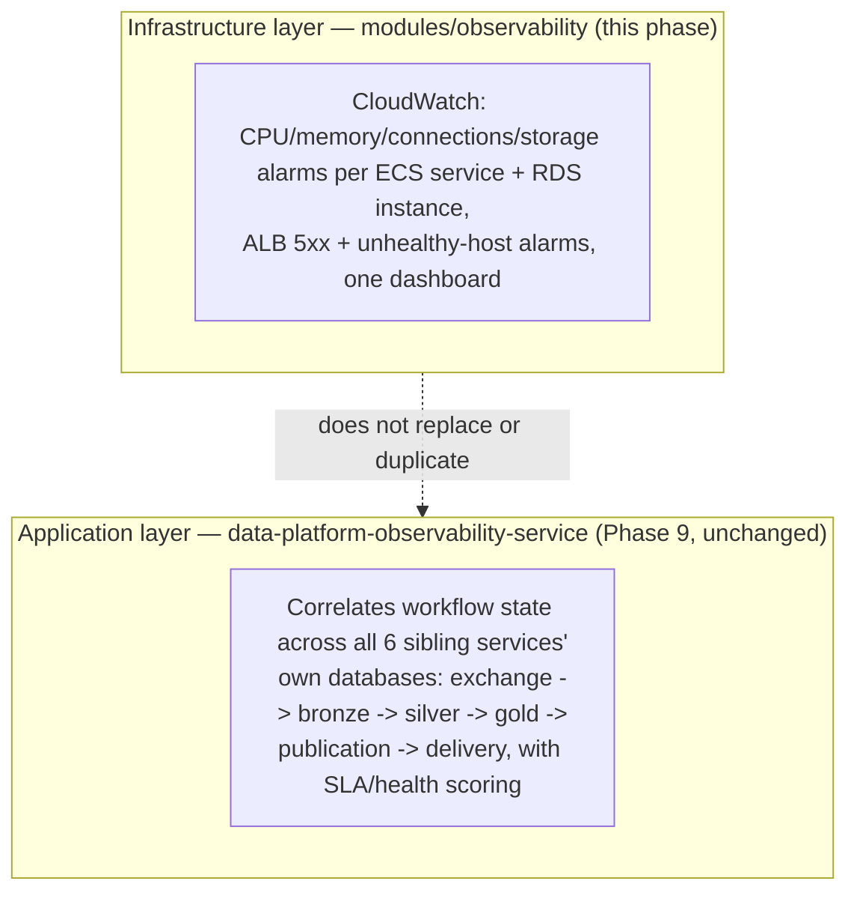

# Observability

Two layers exist, and they are not the same thing:

`modules/observability` is infrastructure-level only: is the ECS task using too much CPU, is RDS
running low on storage, is the ALB returning 5xxs. `data-platform-observability-service` is
business-workflow-level: did this customer's exchange actually make it through Bronze→Silver→Gold
and get published on time. Both matter; neither substitutes for the other, and this phase does not
touch the application-level one (still an ECS service deployed like any other — see
`docs/aws/compute.md`).

## What `modules/observability` creates

- Per ECS service (10x): CPU-high, memory-high alarms (3 consecutive 5-minute periods above 85%).
- Per RDS instance (7x): CPU-high, free-storage-low (<2GB), connection-count-high alarms.
- ALB-level (if `alb_arn_suffix` is wired — not by default, see below): 5xx-count-high,
  per-target-group unhealthy-host alarms.
- One CloudWatch dashboard (`{name_prefix}-platform`) with a CPU/memory widget per ECS service and
  a CPU/connections/storage widget per RDS instance.

`alarm_actions` (SNS topic ARNs or equivalent) is empty by default in every environment — alarms
exist but are silent until you decide where notifications should go (this is deliberately not
decided by Terraform defaults; wire an SNS topic + subscription once you know who's on call).

## Correlation IDs — preserved, not touched

Phase 9's operational read model depends on correlation IDs flowing through every service's
application logs. This phase changes *where* logs are shipped (CloudWatch Logs instead of local
stdout/Docker logs) but not *what* is logged — the `awslogs` driver ships whatever the container
already writes to stdout/stderr verbatim, including any correlation-ID-carrying structured log
lines the application already emits.

## Wiring ALB alarms

`environments/*/main.tf` currently passes `alb_arn_suffix = null` to `modules/observability`
(construct it from `module.alb.alb_arn` — the ARN suffix is the substring after `app/` — and pass
`target_group_arn_suffixes` similarly from each public `module.ecs_service[...].target_group_arn`
once you've decided on `alarm_actions`). Left as a documented one-line follow-up rather than wired
to a made-up SNS topic ARN that would need immediate replacement anyway.

## Metrics/OpenTelemetry — a real gap, not solved here

No metrics-exporter code (Prometheus client, OpenTelemetry SDK) exists in any service today
(confirmed in `docs/aws/current-state-inventory.md`). CloudWatch's own ECS/RDS/ALB metrics (above)
require no code change and are wired by this phase. Application-level custom metrics (request
latency histograms, business-event counters) would require adding an OpenTelemetry SDK to each
service — a real, non-trivial addition, explicitly out of scope here.
